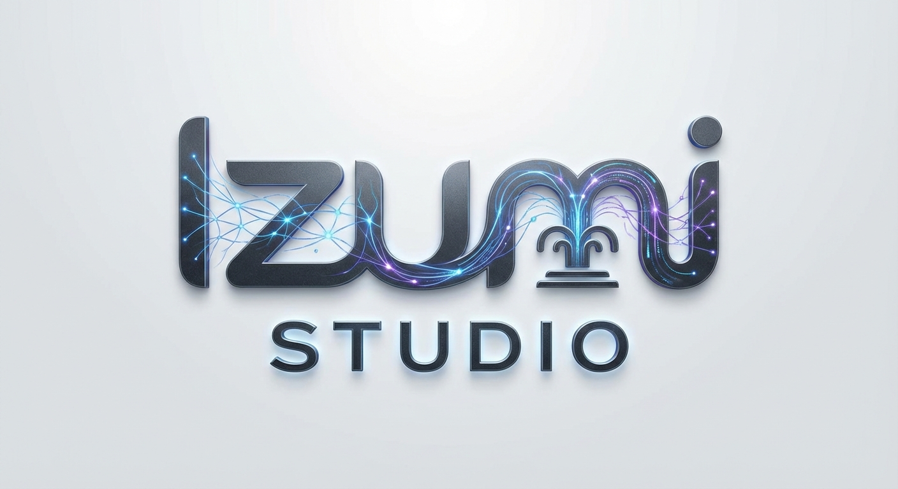

<div align="center">
   
	<br>
  <br>
  <h1 align="center">Izumi: Agentic Multimedia Ecosystem</h1>
  <p align="center"><b>An All-in-One Generative AI Platform for Automated Multimedia Advertisement Creation</b></p>

  <div align="center">
  </div>

  <p align="center">
    
	<a href="https://github.com/astral-sh/uv"></a>
	
    
    
  </p>

  <p align="center">
    <strong>A Unified Monorepo for Building Generative AI Multimedia Agents</strong>
  </p>

</div>

---

Izumi is a comprehensive, all-in-one Generative AI platform designed as a deployable solution for automated multimedia advertisement creation. It serves as a powerful **Google Cloud Best Practice & Reference Architecture**, showcasing the spectrum of Google's state-of-the-art generative AI models on Vertex AI.

Built for creators, marketers, and developers, this application provides a hands-on, interactive experience with cutting-edge multi-agent orchestration, serving as a blueprint for enterprise-grade AI agent deployment.

> ###### _This is not an officially supported Google product. This project is not eligible for the [Google Open Source Software Vulnerability Rewards Program](https://bughunters.google.com/open-source-security)._

---


> [!TIP]
> **💡 The Izumi Solution**
> 🎬 **Creative Workbench**, **Multi-Agent Orchestrator**, and **Ad Generator** **All-in-One**!
> Izumi provides a complete full-stack workbench for building cinematic advertisements and interactive creative sandboxes using Google GenAI / Vertex AI. Simply provide a brief or a few assets, and Izumi handles the reasoning, orchestration, and generation end-to-end. 🚀

---

## 📑 Table of Contents
- [💡 Key Features](#key-features)
- [🔮 The Specialized Agents](#the-specialized-agents)
- [🏗️ Architecture](#architecture)
- [🛠️ Technology Stack](#technology-stack)
- [🚀 Quick Start](#quick-start)
- [🧬 Code Styling & Guidelines](#code-styling--guidelines)
- [🤝 Contributing](#contributing)
- [⚖️ Responsible Use & Disclaimer](#responsible-use--disclaimer)

---

## 💡 Key Features

<table align="center" width="100%" style="border: none; table-layout: fixed;">
<tr>
<td width="25%" align="center" style="vertical-align: top; padding: 20px;">
<div style="height: 80px; display: flex; align-items: center; justify-content: center;">
<h3 style="margin: 0; padding: 0;">🔌 Headless Agents</h3>
</div>
<div style="height: 60px; display: flex; align-items: center; justify-content: center;">
<p align="center">Independent Python FastAPI processes powered by <code>mediagent-kit</code> handling reasoning and orchestration.</p>
</div>
</td>
<td width="25%" align="center" style="vertical-align: top; padding: 20px;">
<div style="height: 80px; display: flex; align-items: center; justify-content: center;">
<h3 style="margin: 0; padding: 0;">🎨 Studio UI</h3>
</div>
<div style="height: 60px; display: flex; align-items: center; justify-content: center;">
<p align="center">Modern React + Vite SPA providing a visual campaign canvas for creators.</p>
</div>
</td>
<td width="25%" align="center" style="vertical-align: top; padding: 20px;">
<div style="height: 80px; display: flex; align-items: center; justify-content: center;">
<h3 style="margin: 0; padding: 0;">⚡ Fast Tooling</h3>
</div>
<div style="height: 60px; display: flex; align-items: center; justify-content: center;">
<p align="center">Leverages <code>uv</code> for blazing fast, deterministic environment resolution.</p>
</div>
</td>
<td width="25%" align="center" style="vertical-align: top; padding: 20px;">
<div style="height: 80px; display: flex; align-items: center; justify-content: center;">
<h3 style="margin: 0; padding: 0;">☁️ Cloud Ready</h3>
</div>
<div style="height: 60px; display: flex; align-items: center; justify-content: center;">
<p align="center">Built-in Terraform IaC suites for enterprise-grade Cloud Run deployments.</p>
</div>
</td>
</tr>
</table>

---

## 🔮 The Specialized Agents

Izumi isn't a single monolithic script—it's a distributed suite of specialized AI Agents. This repository contains four discrete AI workspaces, each tuned for a specific creative workflow:

**🎬 Ads-X Template (Flagship)**
- Our most powerful enterprise orchestrator.
- Gives brands granular control over the timing, pacing, and visual progression of an ad.
- **AI Director Mode:** Autonomously devises narrative pacing while enforcing brand guidelines.
- **Template Mode:** Adheres strictly to a pre-defined JSON skeleton (dictating exact clip lengths and transitions).

**🧬 Elements to Video**
- A specialized narrative chain workflow built explicitly to solve the "character consistency" problem in AI video.
- Anchors generation around persistent subjects (like a mascot or hero product) and drags them seamlessly through multiple generated clips and actions.

**🎨 Creative Toolbox**
- An unstructured, conversational sandbox.
- Deploy the Creative Toolbox to chat naturally with the suite of Vertex AI models to generate one-off concept art, temporary voiceovers, or standalone Veo animations.

---

---

## 🎬 Video Showcase

Here are some examples of cinematic advertisements generated by Izumi.

### 📺 Video Gallery

Click on the thumbnails to view the videos.

<table align="center" width="100%" style="border: none; table-layout: fixed;">
<tr>
<th width="33.33%" style="text-align: center;">Case 1: Scented Candle</th>
<th width="33.33%" style="text-align: center;">Case 2: Luxury High Heels</th>
<th width="33.33%" style="text-align: center;">Case 3: Plant-Based Meat</th>
</tr>
<tr>
<td width="33.33%" align="center"><video src="https://github.com/user-attachments/assets/12345b5a-7cff-4929-9aed-71ac539f4be4" width="200" height="350" style="object-fit: cover;" controls></video></td>
<td width="33.33%" align="center"><video src="https://github.com/user-attachments/assets/bc179a55-2e77-4ab9-b22b-f2dc62f30246" width="200" height="350" style="object-fit: cover;" controls></video></td>
<td width="33.33%" align="center"><video src="https://github.com/user-attachments/assets/1e26800b-f7cd-4402-a6dd-37d64ef84558" width="200" height="350" style="object-fit: cover;" controls></video></td>
</tr>
<tr>
<th width="33.33%" style="text-align: center;">Case 4: Facial Cleanser</th>
<th width="33.33%" style="text-align: center;">Case 5: Resort Sandals</th>
<th width="33.33%" style="text-align: center;">Case 6: Zen Garden Rake</th>
</tr>
<tr>
<td width="33.33%" align="center"><video src="https://github.com/user-attachments/assets/ed7bf24c-e3b7-4623-9e7a-39b37cf96231" width="200" height="350" style="object-fit: cover;" controls></video></td>
<td width="33.33%" align="center"><video src="https://github.com/user-attachments/assets/4e7dfbf4-debe-4f0a-9949-90baf787100e" width="200" height="350" style="object-fit: cover;" controls></video></td>
<td width="33.33%" align="center"><video src="https://github.com/user-attachments/assets/001b2bc2-569b-4564-8e1f-0b4c6b8b0f76" width="200" height="350" style="object-fit: cover;" controls></video></td>
</tr>
<tr>
<th style="text-align: center;">Case 7: Savory Snacks</th>
<th style="text-align: center;">Case 8: Pet Care</th>
<th style="text-align: center;">Case 9: Home Comfort</th>
</tr>
<tr>
<td width="33.33%" align="center"><video src="https://github.com/user-attachments/assets/154da8db-1950-4deb-acee-3108bc3fffdf" width="200" height="350" style="object-fit: cover;" controls></video></td>
<td width="33.33%" align="center"><video src="https://github.com/user-attachments/assets/af5ade24-db2b-47cd-bce3-7e7602134c58" width="200" height="350" style="object-fit: cover;" controls></video></td>
<td width="33.33%" align="center"><video src="https://github.com/user-attachments/assets/249fd96d-8b76-4716-ae49-daa0074a543f" width="200" height="350" style="object-fit: cover;" controls></video></td>
</tr>
</table>

---

### 🔍 Case Details

Expand each case to see the input assets and full prompt.

<details>
<summary><b>Case 1: Scented Candle</b></summary>

#### Input Assets
These images were used as input to guide the agent:

 

#### Full Prompt
> Generate a video advertisement. Beggy Bay packs Beggy-Soy (a candle poured into a lidded metal tin), targeting Female travelers aged 25-34 in Marrakech, Morocco who are interested in travel comfort in hotel rooms.

</details>

<details>
<summary><b>Case 2: Luxury High Heels</b></summary>

#### Input Assets
These images were used as input to guide the agent:

 

#### Full Prompt
> Generate a video advertisement. Grault Design elevates with Grault-Heel (high-heeled footwear intended for performance or social events), targeting Female partygoers aged 18-24 in Ibiza, Spain who are interested in partying and glamour in nightclubs.

</details>

<details>
<summary><b>Case 3: Plant-Based Meat</b></summary>

#### Input Assets
These images were used as input to guide the agent:

 

#### Full Prompt
> Generate a video advertisement. Undefood Inc cooks Undefood-Ground (loose, crumbled plant protein resembling ground meat), targeting Female chefs aged 25-34 in Lima, Peru who are interested in meal prepping on Taco Tuesdays.

</details>

<details>
<summary><b>Case 4: Facial Cleanser</b></summary>

#### Input Assets
These images were used as input to guide the agent:

 

#### Full Prompt
> Generate a video advertisement. BazQux LLC highlights BazQux-Wash (a facial cleansing gel dispensed from a tube container), targeting Female spa lovers aged 35-50 in Stockholm, Sweden who are interested in deep pore cleansing and detox in luxury hotel spas.

</details>

<details>
<summary><b>Case 5: Resort Sandals</b></summary>

#### Input Assets
These images were used as input to guide the agent:

 

#### Full Prompt
> Generate a video advertisement. QuxCorge relaxes with QC-Sandal (open footwear consisting of a sole held to the foot by straps), targeting Female vacationers aged 25-34 in Ubud, Indonesia who are interested in poolside fashion at resorts.

</details>

<details>
<summary><b>Case 6: Zen Garden Rake</b></summary>

#### Input Assets
These images were used as input to guide the agent:

 

#### Full Prompt
> Generate a video advertisement. Amet Tools rakes with Amet-Rake (toothed tool designed for gathering loose debris or smoothing soil), targeting Female mindfulness practitioners aged 25-34 in Kyoto, Japan who are interested in raking sand patterns in zen gardens.

</details>

<details>
<summary><b>Case 7: Savory Snacks</b></summary>

#### Input Assets
These images were used as input to guide the agent:

    

#### Full Prompt
> **Campaign Name**: The Perfect Shake
> **Product/Service**: Premium savory snack line (Potato Chips, Pretzels, Popcorn, and Mixed Nuts)
> **Target Duration**: 15s
> **Format**: Portrait
> 
> **Strategic Context**
> *   **Campaign Theme**: Focusing on the precision and satisfaction of perfectly seasoned snacks.
> *   **Campaign Tone**: Snappy, clean, and rhythmic. Think high-energy cuts synced to a crisp beat.
> *   **Primary Hook**: The "Just Right" seasoning.
> *   **Target Audience**: The Aesthetic Snacker. Young professionals and Gen Z creators who want snacks that look as good on their desks as they taste.
> *   **Brand Voice**: Minimalist, confident, and slightly cheeky.
> 
> **Visual & Narrative Style**
> *   **Visual Style**: Studio Minimalist. High-brightness, clean white backgrounds (matching your provided images) with sharp shadows and vivid product colors (like that metallic red bag).
> *   **Key Message**: SED SNACKS: Seasoned to stand out.
> *   **Setting**: A bright, modern home office and a high-end minimalist kitchen.

</details>

<details>
<summary><b>Case 8: Pet Care</b></summary>

#### Input Assets

    

#### Full Prompt
> Please help me create a 16:9 vertical video ad for CONSECTETUR CO. Use the 'Pet Companion fast pace' template.

</details>

<details>
<summary><b>Case 9: Home Comfort</b></summary>

#### Input Assets

    

#### Full Prompt
> Please help me create a 16:9 vertical video ad for LoremBaz Home. Use the 'Home Comfort (Fast) ' template.

</details>

---

## 🏗️ Architecture

### 📊 System Overview

Izumi is a multi-agent video framework that enables automated multi-shot video generation while ensuring character and scene consistency.

<div align="center">
  <table align="center" width="100%" style="border: none; border-collapse: collapse;">
    <tr>
      <td colspan="3" align="center" style="padding: 20px; background: linear-gradient(135deg, #667eea 0%, #764ba2 100%); border-radius: 15px; color: white; font-weight: bold;">
        🧠 INPUT LAYER<br/>
        📝 Campaign Briefs • 🖼️ User Assets • 🧩 Metadata
      </td>
    </tr>
    <tr><td colspan="3" height="20"></td></tr>
    <tr>
      <td colspan="3" align="center" style="padding: 15px; background: linear-gradient(135deg, #ff6b6b 0%, #ee5a24 100%); border-radius: 12px; color: white; font-weight: bold;">
        🧭 CENTRAL ORCHESTRATION (FastAPI)<br/>
        Parameters Extraction • Storyboard Routing • State Management
      </td>
    </tr>
    <tr><td colspan="3" height="15"></td></tr>
    <tr>
      <td align="center" style="padding: 12px; background: linear-gradient(135deg, #3742fa 0%, #2f3542 100%); border-radius: 10px; color: white; width: 50%;">
        🤖 Specialized Agents<br/>
        <small>ads_x_template • creative_toolbox • elements_to_video</small>
      </td>
      <td width="10"></td>
      <td align="center" style="padding: 12px; background: linear-gradient(135deg, #8c7ae6 0%, #9c88ff 100%); border-radius: 10px; color: white; width: 50%;">
        🛠️ Tooling & Utilities<br/>
        <small>GCS • Vertex AI • Image Gen • Video Gen</small>
      </td>
    </tr>
    <tr><td colspan="3" height="15"></td></tr>
    <tr>
      <td colspan="3" align="center" style="padding: 20px; background: linear-gradient(135deg, #045de9 0%, #09c6f9 100%); border-radius: 15px; color: white; font-weight: bold;">
        🚀 OUTPUT LAYER<br/>
        🎞️ Cinematic Videos • 📊 Structured Storyboards • 📜 Execution Logs
      </td>
    </tr>
  </table>
</div>

---

## 🛠️ Technology Stack

The backend leverages a standardized toolchain provided by the `mediagent_kit` wrapper, providing uniform access to Google's top-tier models:

| Category | Technology / Service |
| :--- | :--- |
| **Frontend** | React, TypeScript, Material UI (MUI), Vite |
| **Backend** | Python 3.12, FastAPI, Pydantic |
| **Orchestration** | Google Vertex AI Agent Development Kit (ADK) |
| **Reasoning & Copy** | **Gemini**: Copywriting, reasoning, and orchestration |
| **Visual Gen** | **Imagen & Gemini**: First-frame generation and storyboard composition |
| **Video Gen** | **Veo**: Cinematic video generation |
| **Audio Gen** | **Lyria**: Dynamic background music composition |
| **Voiceover** | **Google Cloud TTS**: Studio-grade voiceovers |
| **Database** | Google Cloud Firestore (Local Emulator supported) |

> [!NOTE]
> **Centralized Model Configuration**: All AI models used by the services are centrally configured in `mediagent_config.json` located in the project root. This file allows you to map specific models to specific tasks (e.g., `default`, `enrichment`, `repair`) and lists compatible models for reference.

---

## 🚀 Quick Start

### 🖥️ 1. Mandatory Prerequisites

You **must** install `uv` to manage dependencies and run the workspace.

```bash
# 1. Install uv
curl -LsSf https://astral.sh/uv/install.sh | sh

# 2. Add it to your PATH immediately for this session
export PATH="$HOME/.local/bin:$PATH"
```

### 🖥️ 2. Setup Development Workspace

1.  **Authentication**
    Configure your local environment with ambient cloud application credentials:
    ```bash
    gcloud auth login
    gcloud auth application-default login
    ```

2.  **Sync Workspace Dependencies**
    Instantly resolve and install all project packages:
    ```bash
    uv sync
    ```

3.  **Setup Environment Manifests**
    Provision standard `.env.local` bindings for GCP:
    ```bash
    uv run scripts/setup_gcp_project.py --app_env local
    ```


### 🎯 Launching the Workspace

#### 🔴 Path A: Local Emulator (Recommended)
This starts a local mock database. It isolates your work and prevents conflicts with shared cloud data.
```bash
./scripts/start-all.sh --with-db-emulator
```
- **Frontend:** http://localhost:5173
- **Backend API:** http://localhost:8000
- **API Docs (Swagger):** http://localhost:8000/docs

#### ☁️ Path B: Live Google Cloud
Connects your local server directly to your live Google Cloud Firestore instance.
```bash
./scripts/start-all.sh
```

### 📝 Environment Configuration Example

To connect your local environment to your GCP resources, you can manually verify or update the generated `.env.local` file in `demos/backend/`. Here is an example of what it should contain:

```bash
# Common environment variables
FRONTEND_URL="http://localhost:5173"
ENVIRONMENT="local"
LOG_LEVEL="INFO"

# Google Cloud Project configuration
GOOGLE_CLOUD_PROJECT="your-gcp-project-id"
PROJECT_ID="your-gcp-project-id"

# Firestore configuration (leave blank for default)
FIRESTORE_DATABASE_ID=""

# GCS Buckets
GCS_BUCKET_NAME="your-sandbox-bucket-name"
```

For the frontend in `demos/frontend/.env`:
```env
VITE_API_BASE_URL=http://localhost:8000
```


## 💡 Troubleshooting

### mTLS / Certificate Errors
If you encounter an error like `a bytes-like object is required, not 'NoneType'` originating from `mtls.py`, or other mTLS connection failures:
1. Open `demos/backend/.env.local`.
2. Add the following lines to bypass the Mutual TLS check:
   ```env
   GOOGLE_API_USE_MTLS=never
   GOOGLE_API_USE_CLIENT_CERTIFICATE=false
   ```
3. Restart the application.

---

## 🧬 Code Styling & Guidelines

To maintain code quality and consistency:

- **Python (Backend):** We adhere to high standards of formatting and linting.
  - We use `black` for code formatting.
  - We use `pylint` for static code analysis.
  - The repository maintains an **80% coverage threshold** for core modules.
- **Frontend (TypeScript):** Follows standard React and TypeScript guidelines, using Vite for development.

### Running Checks Manually

To check for linting issues or format code:

```bash
# Run pytest with coverage
uv run pytest tests/demos/ --cov=demos/backend --cov-report=term-missing

# Run pre-commit hooks (runs black, pylint, etc.)
uv run pre-commit run --all-files
```

---

## 🤝 Contributing

We welcome contributions to Izumi! Whether it's new templates, features, bug fixes, or documentation improvements, your help is valued.

### Branching Model
Please create feature branches and submit pull requests. Ensure your commits follow standard conventions and pass all pre-commit hooks.

---

## ⚖️ Responsible Use & Disclaimer

Building and deploying generative AI agents requires a commitment to responsible development practices. Izumi provides you the tools to build agents, but you must also provide the commitment to ethical and fair use of these agents. We encourage you to:

*   **Start with a Risk Assessment:** Before deploying your agent, identify potential risks related to bias, privacy, safety, and accuracy.
*   **Document Your Process:** Maintain detailed records of your development process, including data sources, models, configurations, and mitigation strategies.

### ⚖️ Disclaimer

> [!IMPORTANT]
> **This is not an officially supported Google product.**
> This repository is provided "as is" without any warranties, express or implied. Users assume all responsibility for the deployment, costs, and content generated by the AI agents. This project is not eligible for the Google Open Source Software Vulnerability Rewards Program.

Copyright 2026 Google LLC. All Rights Reserved.

Licensed under the Apache License, Version 2.0 (the "License"); you may not use this file except in compliance with the License. You may obtain a copy of the License at [http://www.apache.org/licenses/LICENSE-2.0](http://www.apache.org/licenses/LICENSE-2.0).

---

## ☁️ Cloud Deployments

To deploy these headless agents up into serverless Google Cloud Run profiles under high compliance environments (IAP protection, Terraform auditing), refer to the [Deployment Guide](deployment/README.md).

---

## ☄️ More to Come

Stay tuned for exciting future updates! We are planning a deep integration with [GCC Creative Studio](https://github.com/GoogleCloudPlatform/gcc-creative-studio) to merge the power of multi-agent video orchestration with Creative Studio's comprehensive GenAI platform.

🎉 **Meet us at Cloud Next 2026!**
Our team will be attending Cloud Next 2026 and hosting a booth alongside Creative Studio. Feel free to come by to learn more! Connect with us on [LinkedIn](https://www.linkedin.com/company/google-cloud-next/) for updates.
