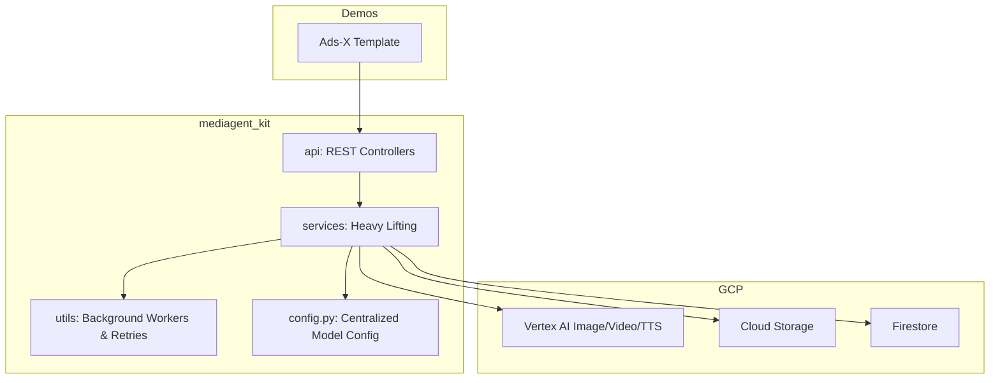

<div align="center">
  <h1>Mediagent Kit 🧰</h1>
  <p><strong>The Asynchronous Backbone of the GenMedia Agent Ecosystem</strong></p>
  <p align="center">
    
    
    
  </p>
</div>

---

## 📖 Overview

The `mediagent_kit` is the core Python Software Development Kit (SDK) that powers the entire GenMedia Izumi architecture. While the orchestrator pipelines (like `ads_x_template` and `creative_toolbox`) define *what* video an agent should make, the `mediagent_kit` defines exactly *how* to safely and asynchronously communicate with Google Cloud infrastructure to execute it.

By completely decoupling this layer from the specific front-end or back-end implementations, the `mediagent_kit` empowers developers to instantiate secure Vertex AI generation wrappers, ffmpeg handlers, and database listeners natively in their own applications.

### 📊 Architecture




## 🧱 Submodule Architecture

The `mediagent_kit` is organized into focused submodules to ensure a strict separation of concerns:

| Submodule | Description | Key Files |
| :--- | :--- | :--- |
| **[`/api`](api/)** | **REST Controllers**: Exposes endpoints for the React frontend, managing session state, assets, and triggers. | `sessions.py`, `assets.py`, `media_generation.py` |
| **[`/services`](services/)** | **Heavy Lifters**: Wraps native GCP calls, handles database interactions, and orchestrates FFmpeg. | `media_generation_service.py`, `video_stitching_service.py` |
| **[`/frontend`](frontend/)** | **Static Debugger**: Lightweight vanilla JS pages to trace API states without full React build. | `index.html` |
| **`/utils`** | **Execution Abstractions**: Polling wrappers, background workers, and retry logic. | `retry.py`, `background_job_runner.py` |

## 🛠️ Getting Started for Developers

To integrate `mediagent_kit` into your own specialized agent or demo:

### 1. Installation

Ensure the package is available in your Python environment. Since this is a local package in the monorepo, you can include it in your environment by ensuring the root directory is in your Python path, or by using workspace references if applicable.

### 2. Configuration

Initialize the `MediagentKitConfig` with your specific Google Cloud infrastructure details. The class accepts the following key parameters:

*   `google_cloud_project`: Your GCP Project ID.
*   `google_cloud_location`: The region for Vertex AI calls (e.g., `us-central1`).
*   `asset_service_gcs_bucket`: The Cloud Storage bucket name for storing generated assets.
*   `firestore_database_id`: (Optional) The Firestore database ID if not using the default.

### 3. Usage Example

Here is a complete example of how to configure and mount the SDK onto a FastAPI application:

```python
from fastapi import FastAPI
from mediagent_kit.server import mount_to_fastapi_app
from mediagent_kit.config import MediagentKitConfig

# 1. Initialize configuration
# Note: Centralized model overrides from mediagent_config.json 
# will be loaded automatically if the file exists in the CWD.
config = MediagentKitConfig(
    google_cloud_project="your-project-id",
    google_cloud_location="us-central1",
    asset_service_gcs_bucket="your-assets-bucket"
)

# 2. Create your FastAPI app
app = FastAPI(title="My Custom Agent API")

# 3. Mount the Mediagent SDK (Adds /assets, /jobs, /canvases, etc.)
mount_to_fastapi_app(app, config)
```

For details on how to customize the default AI models used by the services, see the `mediagent_config.json` file in the project root.
