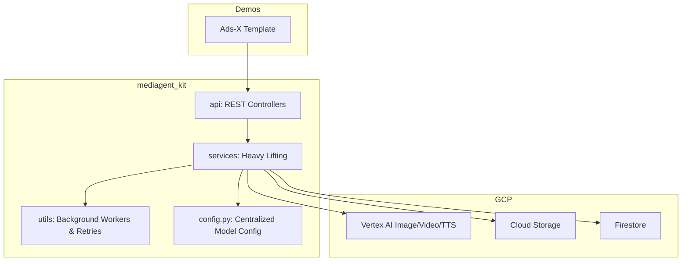

<div align="center">
  <h1>Mediagent Kit 🧰</h1>
  <p><strong>The Asynchronous Backbone of the GenMedia Agent Ecosystem</strong></p>
  <p align="center">
    
    
    
  </p>
</div>

---

## 📖 Overview

The `mediagent_kit` is the core Python Software Development Kit (SDK) that powers the entire GenMedia Izumi architecture. While the orchestrator pipelines (like `ads_x_template` and `creative_toolbox`) define *what* video an agent should make, the `mediagent_kit` defines exactly *how* to safely and asynchronously communicate with Google Cloud infrastructure to execute it.

By completely decoupling this layer from the specific front-end or back-end implementations, the `mediagent_kit` empowers developers to instantiate secure Vertex AI generation wrappers, ffmpeg handlers, and database listeners natively in their own applications.

### 📊 Architecture




## 🧱 Submodule Architecture

The `mediagent_kit` is organized into focused submodules to ensure a strict separation of concerns:

| Submodule | Description | Key Files |
| :--- | :--- | :--- |
| **[`/api`](api/)** | **REST Controllers**: Exposes endpoints for the React frontend, managing session state, assets, and triggers. | `sessions.py`, `assets.py`, `media_generation.py` |
| **[`/services`](services/)** | **Heavy Lifters**: Wraps native GCP calls, handles database interactions, and orchestrates FFmpeg. | `media_generation_service.py`, `video_stitching_service.py` |
| **[`/frontend`](frontend/)** | **Static Debugger**: Lightweight vanilla JS pages to trace API states without full React build. | `index.html` |
| **[`/utils`](utils/)** | **Execution Abstractions**: Polling wrappers, background workers, and retry logic. | `retry.py`, `background_job_runner.py` |

## 🎬 Best Practices for Content Creators

To ensure the absolute highest fidelity and smoothest media rendering experience when producing commercial video campaigns through Izumi, please follow these professional studio guidelines:

### 1. Start Fresh: One Campaign per Workspace
- **Why it Matters**: Just like organizing footage in a professional editing bay, mixing multiple products and brands into the same Izumi workspace can clutter your media library. Uploaded images and rendered clips accumulate in the right-hand canvas panel.
- **Pro-Tip**: To keep your art direction perfectly focused, always **create a completely new Izumi project** whenever you begin generating an entirely new advertising campaign.

### 2. Keep Content Commercial-Safe (Veo Compliance)
- **Why it Matters**: The underlying Google Veo video engine is highly optimized for premium commercial rendering and enforces strict safety compliance guidelines. 
- **Pro-Tip**: Ensure your creative scripts and visual action prompts maintain standard PG-rated, brand-safe commercial messaging. If the Veo engine detects sensitive, explicit, or restricted topics, the video rendering pipeline will automatically pause, outputting a **high-quality static frame** in place of your full video clip to protect brand integrity.
- **Reference**: Review the official [Vertex AI Responsible AI and Usage Guidelines](https://docs.cloud.google.com/vertex-ai/generative-ai/docs/video/responsible-ai-and-usage-guidelines) for complete details on content policies.

## 🛠️ Getting Started for Developers

To integrate `mediagent_kit` into your own specialized agent or demo:

### 1. Installation

Ensure the package is available in your Python environment. Since this is a local package in the monorepo, you can include it in your environment by ensuring the root directory is in your Python path, or by using workspace references if applicable.

### 2. Configuration

Initialize the `MediagentKitConfig` with your specific Google Cloud infrastructure details. The class accepts the following key parameters:

*   `google_cloud_project`: Your GCP Project ID.
*   `google_cloud_location`: The region for Vertex AI calls (e.g., `us-central1`).
*   `asset_service_gcs_bucket`: The Cloud Storage bucket name for storing generated assets.
*   `firestore_database_id`: (Optional) The Firestore database ID if not using the default.

### 3. Usage Example

Here is a complete example of how to configure and mount the SDK onto a FastAPI application:

```python
from fastapi import FastAPI
from mediagent_kit.server import mount_to_fastapi_app
from mediagent_kit.config import MediagentKitConfig

# 1. Initialize configuration
# Note: Centralized model overrides from mediagent_config.json 
# will be loaded automatically if the file exists in the CWD.
config = MediagentKitConfig(
    google_cloud_project="your-project-id",
    google_cloud_location="us-central1",
    asset_service_gcs_bucket="your-assets-bucket"
)

# 2. Create your FastAPI app
app = FastAPI(title="My Custom Agent API")

# 3. Mount the Mediagent SDK (Adds /assets, /jobs, /canvases, etc.)
mount_to_fastapi_app(app, config)
```

For details on how to customize the default AI models used by the services, see the `mediagent_config.json` file in the project root.
## 📊 API Usage & Cost Calculation

This section provides a detailed estimate of the API calls and associated costs for generating videos using the Izumi ecosystem, based on the actual end-to-end pipeline observed in logs (e.g., `app_20260415_160516.log`) and official pricing.

> [!TIP]
> For the most up-to-date pricing, please refer to the official [Gemini API Pricing Documentation](https://ai.google.dev/gemini-api/docs/pricing).

### 🛠️ Pipeline Models in Use
Based on the codebase (`agent.py` and `mediagent_config.json`), the pipeline uses a multi-model approach:
-   🤖 **Root & Sequential Agents**: `gemini-2.5-flash`
-   🎬 **Custom Storyboard Agent**: `gemini-3.1-pro-preview`
-   📋 **Templated Storyboard Agent**: `gemini-3-flash-preview`
-   ✨ **Prompt Enrichment**: `gemini-3-flash-preview`
-   🎨 **Image Generation**: `gemini-3.1-flash-image-preview`
-   🗣️ **Voiceover (TTS)**: `gemini-3.1-flash-tts-preview`
-   🎥 **Video Generation**: `veo-3.1-generate-001`
-   🎵 **Music**: `lyria-3-clip-preview`

---

### 📈 Scenario Breakdown

We analyze the two real use cases available in the repository to demonstrate the cost difference between a custom creative pipeline and a templated one. The estimates are grounded in actual log traces for a full run.

### 🎬 Case 1: Custom Cinematic Ad ("SED Snacks")
This scenario involves dynamic planning, script generation, asset description, and iterative tool use by the agent.
-   **Target Duration**: 15 seconds (4 scenes).
-   **Agent Mode**: Custom Storyboard (`gemini-3.1-pro-preview`).

<table style="width: 100%; border-collapse: collapse;">
  <thead>
    <tr style="background-color: #eef2f7; border-bottom: 2px solid #cfd8dc;">
      <th style="padding: 12px; text-align: left;">Step / API</th>
      <th style="padding: 12px; text-align: left;">Model</th>
      <th style="padding: 12px; text-align: left;">Estimated Usage</th>
      <th style="padding: 12px; text-align: left;">Rate</th>
      <th style="padding: 12px; text-align: right;">Estimated Cost</th>
    </tr>
  </thead>
  <tbody>
    <tr style="border-bottom: 1px solid #e0e0e0;">
      <td style="padding: 12px;">🧭 <b>Orchestration & Helpers</b></td>
      <td style="padding: 12px;"><code>gemini-2.5-flash</code></td>
      <td style="padding: 12px;">~9 calls (Params, Assets loop, Strategy, Router, VO rewrite)<br><small style="color: #757575;">~50k Input, ~5k Output</small></td>
      <td style="padding: 12px;"><small>$0.30 / 1M in<br>$2.50 / 1M out</small></td>
      <td style="padding: 12px; text-align: right;">~$0.0275</td>
    </tr>
    <tr style="border-bottom: 1px solid #e0e0e0;">
      <td style="padding: 12px;">📝 <b>Asset Descriptions</b></td>
      <td style="padding: 12px;"><code>gemini-3.1-pro-preview</code></td>
      <td style="padding: 12px;">5 asset desc calls (1 per asset)<br><small style="color: #757575;">~15k Input, ~1k Output</small></td>
      <td style="padding: 12px;"><small>$2.00 / 1M in<br>$12.00 / 1M out</small></td>
      <td style="padding: 12px; text-align: right;">~$0.0420</td>
    </tr>
    <tr style="border-bottom: 1px solid #e0e0e0;">
      <td style="padding: 12px;">📋 <b>Custom Storyboard</b></td>
      <td style="padding: 12px;"><code>gemini-3.1-pro-preview</code></td>
      <td style="padding: 12px;">1 storyboard call<br><small style="color: #757575;">~15k Input, ~5k Output</small></td>
      <td style="padding: 12px;"><small>$2.00 / 1M in<br>$12.00 / 1M out</small></td>
      <td style="padding: 12px; text-align: right;">~$0.0900</td>
    </tr>
    <tr style="border-bottom: 1px solid #e0e0e0;">
      <td style="padding: 12px;">✨ <b>Prompt Enrichment</b></td>
      <td style="padding: 12px;"><code>gemini-3-flash-preview</code></td>
      <td style="padding: 12px;">8 calls (4 image, 4 video)<br><small style="color: #757575;">~30k Input, ~2k Output</small></td>
      <td style="padding: 12px;"><small>$0.50 / 1M in<br>$3.00 / 1M out</small></td>
      <td style="padding: 12px; text-align: right;">~$0.0210</td>
    </tr>
    <tr style="border-bottom: 1px solid #e0e0e0;">
      <td style="padding: 12px;">🎨 <b>Image Generation</b></td>
      <td style="padding: 12px;"><code>gemini-3.1-flash-image-preview</code></td>
      <td style="padding: 12px;">4 images (1024x1024px)</td>
      <td style="padding: 12px;"><small>$0.067 / img</small></td>
      <td style="padding: 12px; text-align: right;">~$0.2680</td>
    </tr>
    <tr style="border-bottom: 1px solid #e0e0e0;">
      <td style="padding: 12px;">🎥 <b>Video Generation</b></td>
      <td style="padding: 12px;"><code>Veo 3.1</code> (Fast 720p)</td>
      <td style="padding: 12px;">16 seconds generated (4 scenes * 4s)</td>
      <td style="padding: 12px;"><small>$0.10 / sec</small></td>
      <td style="padding: 12px; text-align: right;">$1.6000</td>
    </tr>
    <tr style="border-bottom: 1px solid #e0e0e0;">
      <td style="padding: 12px;">🗣️ <b>Voiceover</b></td>
      <td style="padding: 12px;"><code>gemini-3.1-flash-tts-preview</code></td>
      <td style="padding: 12px;">~3 successful calls (~1000 audio tokens)</td>
      <td style="padding: 12px;"><small>$20.00 / 1M out</small></td>
      <td style="padding: 12px; text-align: right;">~$0.0200</td>
    </tr>
    <tr style="border-bottom: 1px solid #e0e0e0;">
      <td style="padding: 12px;">🎵 <b>Music</b></td>
      <td style="padding: 12px;"><code>lyria-3-clip-preview</code></td>
      <td style="padding: 12px;">1 track (30s)</td>
      <td style="padding: 12px;"><small>$0.04 / song</small></td>
      <td style="padding: 12px; text-align: right;">$0.0400</td>
    </tr>
    <tr style="background-color: #eef2f7; font-weight: bold;">
      <td colspan="4" style="padding: 12px; text-align: right;">Total Estimated Cost</td>
      <td style="padding: 12px; text-align: right;">~$2.11</td>
    </tr>
  </tbody>
</table>

### 📋 Case 2: Template Mode ("Pet Companion Fast")
This scenario uses the "Pet Companion (Fast)" template, which defines 8 scenes with a target duration of 24 seconds. Although the final video is trimmed to 24 seconds, the system generates a standard duration (4 seconds) per scene before trimming.
-   **Target Duration**: 24 seconds (8 scenes).
-   **Agent Mode**: Templated Storyboard (`gemini-3-flash-preview`).

<table style="width: 100%; border-collapse: collapse;">
  <thead>
    <tr style="background-color: #eef2f7; border-bottom: 2px solid #cfd8dc;">
      <th style="padding: 12px; text-align: left;">Step / API</th>
      <th style="padding: 12px; text-align: left;">Model</th>
      <th style="padding: 12px; text-align: left;">Estimated Usage</th>
      <th style="padding: 12px; text-align: left;">Rate</th>
      <th style="padding: 12px; text-align: right;">Estimated Cost</th>
    </tr>
  </thead>
  <tbody>
    <tr style="border-bottom: 1px solid #e0e0e0;">
      <td style="padding: 12px;">🧭 <b>Orchestration & Helpers</b></td>
      <td style="padding: 12px;"><code>gemini-2.5-flash</code></td>
      <td style="padding: 12px;">~12 calls<br><small style="color: #757575;">~60k Input, ~6k Output</small></td>
      <td style="padding: 12px;"><small>$0.30 / 1M in<br>$2.50 / 1M out</small></td>
      <td style="padding: 12px; text-align: right;">~$0.0330</td>
    </tr>
    <tr style="border-bottom: 1px solid #e0e0e0;">
      <td style="padding: 12px;">📝 <b>Asset Descriptions</b></td>
      <td style="padding: 12px;"><code>gemini-3.1-pro-preview</code></td>
      <td style="padding: 12px;">8 asset desc calls<br><small style="color: #757575;">~24k Input, ~1.5k Output</small></td>
      <td style="padding: 12px;"><small>$2.00 / 1M in<br>$12.00 / 1M out</small></td>
      <td style="padding: 12px; text-align: right;">~$0.0660</td>
    </tr>
    <tr style="border-bottom: 1px solid #e0e0e0;">
      <td style="padding: 12px;">📋 <b>Template Storyboard</b></td>
      <td style="padding: 12px;"><code>gemini-3-flash-preview</code></td>
      <td style="padding: 12px;">1 call<br><small style="color: #757575;">~10k Input, ~3k Output</small></td>
      <td style="padding: 12px;"><small>$0.50 / 1M in<br>$3.00 / 1M out</small></td>
      <td style="padding: 12px; text-align: right;">~$0.0140</td>
    </tr>
    <tr style="border-bottom: 1px solid #e0e0e0;">
      <td style="padding: 12px;">✨ <b>Prompt Enrichment</b></td>
      <td style="padding: 12px;"><code>gemini-3-flash-preview</code></td>
      <td style="padding: 12px;">16 calls (8 image, 8 video)<br><small style="color: #757575;">~60k Input, ~4k Output</small></td>
      <td style="padding: 12px;"><small>$0.50 / 1M in<br>$3.00 / 1M out</small></td>
      <td style="padding: 12px; text-align: right;">~$0.0420</td>
    </tr>
    <tr style="border-bottom: 1px solid #e0e0e0;">
      <td style="padding: 12px;">🎨 <b>Image Generation</b></td>
      <td style="padding: 12px;"><code>gemini-3.1-flash-image-preview</code></td>
      <td style="padding: 12px;">8 images (1024x1024px)</td>
      <td style="padding: 12px;"><small>$0.067 / img</small></td>
      <td style="padding: 12px; text-align: right;">~$0.5360</td>
    </tr>
    <tr style="border-bottom: 1px solid #e0e0e0;">
      <td style="padding: 12px;">🎥 <b>Video Generation</b></td>
      <td style="padding: 12px;"><code>Veo 3.1</code> (Fast 720p)</td>
      <td style="padding: 12px;">32 seconds generated (8 scenes * 4s)</td>
      <td style="padding: 12px;"><small>$0.10 / sec</small></td>
      <td style="padding: 12px; text-align: right;">$3.2000</td>
    </tr>
    <tr style="border-bottom: 1px solid #e0e0e0;">
      <td style="padding: 12px;">🗣️ <b>Voiceover</b></td>
      <td style="padding: 12px;"><code>gemini-3.1-flash-tts-preview</code></td>
      <td style="padding: 12px;">~6 successful calls (~2000 audio tokens)</td>
      <td style="padding: 12px;"><small>$20.00 / 1M out</small></td>
      <td style="padding: 12px; text-align: right;">~$0.0420</td>
    </tr>
    <tr style="border-bottom: 1px solid #e0e0e0;">
      <td style="padding: 12px;">🎵 <b>Music</b></td>
      <td style="padding: 12px;"><code>lyria-3-clip-preview</code></td>
      <td style="padding: 12px;">1 track (30s)</td>
      <td style="padding: 12px;"><small>$0.04 / song</small></td>
      <td style="padding: 12px; text-align: right;">$0.0400</td>
    </tr>
    <tr style="background-color: #eef2f7; font-weight: bold;">
      <td colspan="4" style="padding: 12px; text-align: right;">Total Estimated Cost</td>
      <td style="padding: 12px; text-align: right;">~$4.03</td>
    </tr>
  </tbody>
</table>

> [!WARNING]
> **Real-World Costs May Be Higher**: The above estimates are for a **single successful run** with no iterations or retries. In practice, costs can be significantly higher (often **$5.00 - $15.00+** per use case) due to:
> 1. **Iterative Refinement**: If you ask the agent to regenerate scenes or modify the script, it will incur additional LLM and media generation costs.
> 2. **Large Asset Ingestion**: Passing multiple high-resolution images or videos as context to the prompt will consume many more tokens (e.g., ~1290 tokens per 1024x1024 image).
> 3. **Retry Logic**: Any failures and retries in the generation process will add to the total cost.
> 4. **Quality Settings**: Using higher resolution or frame rate models for video will increase costs.

<details>
<summary>🔍 Detailed Pricing Reference (Paid Tier)</summary>

| Model | Input (per 1M) | Output (per 1M) | Notes |
| :--- | :--- | :--- | :--- |
| **Gemini 3.1 Pro Preview** | $2.00 (<=200k) | $12.00 (<=200k) | $4.00/>200k in, $18.00/>200k out |
| **Gemini 3.1 Flash-Lite** | $0.25 | $1.50 | |
| **Gemini 3 Flash Preview** | $0.50 | $3.00 | |
| **Gemini 2.5 Pro** | $1.25 (<=200k) | $10.00 (<=200k) | |
| **Gemini 2.5 Flash** | $0.30 | $2.50 | |
| **Gemini 3.1 Flash Image** | $0.50 | $60.00 | ~$0.067 per 1K image |
| **Gemini 3.1 Flash TTS** | $1.00 | $20.00 | Audio tokens: 25 per second |

**Veo 3.1 Video Generation:**
-   **Standard**: $0.40/sec (720p/1080p), $0.60/sec (4K)
-   **Fast**: $0.10/sec (720p), $0.12/sec (1080p), $0.30/sec (4K)
-   **Lite**: $0.05/sec (720p), $0.08/sec (1080p)

**Music Generation:**
-   **Lyria 3 Clip Preview**: $0.04 per song (30s)
-   **Lyria 3 Pro Preview**: $0.08 per song (Full)

</details>


